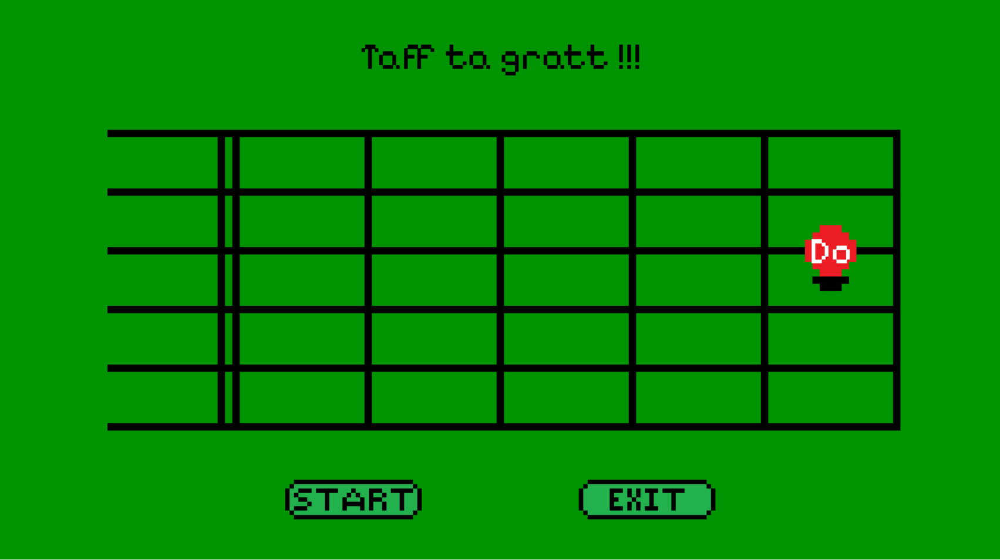

Taff ta gratt est un projet perso ayant pour but d'aider ceux qui en ont besoin à apprendre où se trouvent les notes de guitare sur un fretboard.

Il est nécessaire d'installer la version 3.12.6 de python et pygame pour pouvoir utiliser l'application.